<div align="center">



[](https://abhiraj-portfolio-website.vercel.app/)
[](https://docs.google.com/document/d/1MNLO8-Utx6-QG4e23H-zYVbwS6-jft4S/edit?usp=sharing)
[](https://www.linkedin.com/in/abhirajsingh27/)
[](mailto:itsabhiraj27@gmail.com)

</div>

### `❯ python3 about.py`

```python
class AbhirajSingh:
    def __init__(self):
        self.username = "abhiraj75"
        self.location = "Bengaluru, India 🇮🇳"
        self.current_focus = ["Agentic LLM Pipelines", "Voice AI", "Full-Stack Products"]
        self.philosophy = "Pick unfamiliar domains on purpose - that's where you learn fastest"

    def say_hi(self):
        print("Thanks for dropping by! Let's build something amazing together 🚀")

me = AbhirajSingh()
me.say_hi()
```

### `❯ cat about.txt`

```text
[exp]   Ex-AI Engineering Intern @ Aatra (Jul - Sept 2026)
        Built a production system that tracks tax-law changes across all
        50 US states and classifies every rate, taxability and nexus shift
[build] Full-stack products and AI tools: schema-validated LLM agents, voice-AI
[like]  Systems where correctness is the hard part: guardrails in code, not prompts
[oss]   Active open-source contributor
```

### `❯ ls ~/projects`

| Project | What it does |
|---|---|
| [**SaaS Support Agent**](https://github.com/abhiraj75/SaaS_support_agent) | Tool-calling support agent with a spend gate enforced in code and server-side identity to resist prompt injection |
| [**108 EMS Voice PCR**](https://github.com/abhiraj75/ems_voice_pcr) | Converts Hinglish/English ambulance handoffs into structured patient care reports (Groq Whisper + Llama 3.3) |
| [**DebugX**](https://github.com/abhiraj75/DebugX) | Coding practice platform with live judging, AI feedback, and a sandboxed line-by-line Python visualiser |
| [**BTC Next-Hour Predictor**](https://github.com/abhiraj75/BTC-predictor) | GBM + FIGARCH Monte Carlo model with 95.1% coverage across a 720-prediction backtest |
| [**Chain Lens**](https://github.com/abhiraj75/Chain-Lens-Bitcoin) | Decodes raw Bitcoin transactions and blocks into structured JSON reports |

### `❯ echo $STACK`

<p align="center">
  
  <br/>
  
</p>

### `❯ git log --graph`

<div align="center">
  
  <br/>
  <picture>
    <source media="(prefers-color-scheme: dark)" srcset="https://raw.githubusercontent.com/abhiraj75/abhiraj75/output/github-snake-dark.svg" />
    
  </picture>
</div>

```bash
abhiraj@github:~$ exit  # thanks for dropping by 👋
```
